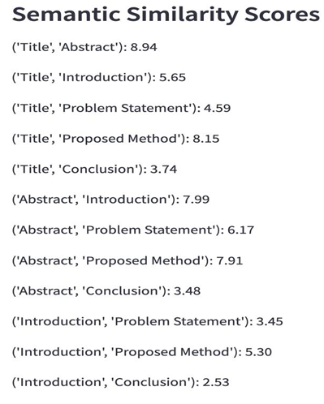

# ScriptSure: Manuscript Relevance Checker
📌 Project Overview
ScriptSure is a **Manuscript Relevance Checker** that helps students and researchers analyze the **coherence and alignment** of different sections in their research papers. By extracting content from PDFs, summarizing key sections, and calculating semantic similarity, the tool determines if all sections are **contextually relevant** to each other.

## 🚀 Features
- 📄 **PDF Text Extraction** – Extracts content from research papers using `pdfplumber`.
- 📖 **Section Segmentation** – Identifies key sections like Title, Abstract, Introduction, etc.
- 📝 **Text Summarization** – Generates concise summaries using `Sumy`'s LSA summarizer.
- 🤖 **Semantic Similarity Analysis** – Uses `SentenceTransformers` and `cosine similarity` to compare section relevance.
- ✅ **Relevance Checker** – Determines whether the research paper sections are well-aligned.
- 🎨 **Interactive UI** – Built with `Streamlit` for seamless document analysis.

## 🛠️ Technologies Used
- **Python** 🐍
- **Streamlit** (for UI)
- **pdfplumber** (for PDF text extraction)
- **Regex** (for text cleaning)
- **Sumy** (for text summarization)
- **SentenceTransformers** (for semantic similarity analysis)
- **Scikit-learn** (for cosine similarity calculations)

## 📊 Results & Screenshots
- File Upload Interface.png
- [Final Relevance Check] (https://github.com/Jaya-Mathur/ScriptSure-Manuscript-Relevance-Checker/blob/f4ac801f742d855f618c3b5710f0b75ec50f75c3/Final%20Relevance%20Check.png)

## 💡 Future Enhancements
- 📑 Support for multiple document formats (DOCX, TXT).
- 📊 Visualization of section relevance scores.
- 🌍 Cloud-based deployment for accessibility.
